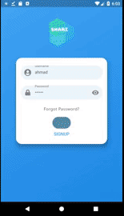

___

# Releases:-
### website
<a href="https://shari-amazon.tk" class="button big" style="font-width:900">   

 shari-amazon.tk  (demo)</a>
### android
<a href="https://github.com/eLMoMaNi/Shari/tree/master/mobile_app/build/app/outputs/apk/release" class="button big" style="font-width:900">   

 android apk  (demo)</a>
 
   
# Folders:-

.

## web_app 

    Back-end, front-end and database models with Django framework
## mobile_app

    Mobile app for IOS and Android with Flutter 
    
## docs 

    Project documentation 
    
## cloud 

    Cloud deployment details and architecture
    
___

# APIs
##### Shari uses RESTful APIs for communication with back-end, also they are intended to be available for developers and researchers 

### [ Documentation](docs/API.md)  

___

# AWS Cloud Architecture

##### Shari provides its services for web & mobile platform all over Serverless environment with Django-based AWS lambda functions  

___

.
## Note: All works done so far are only for development environment.
